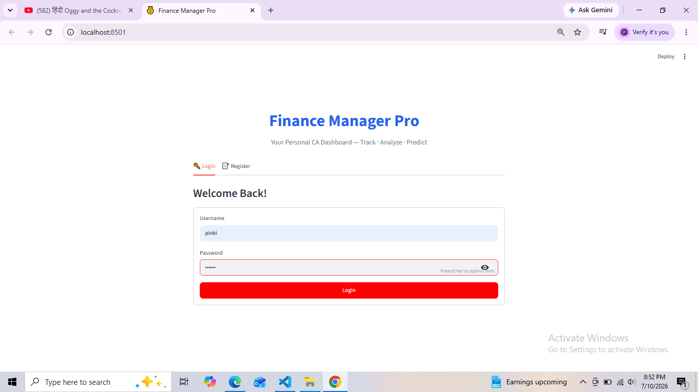
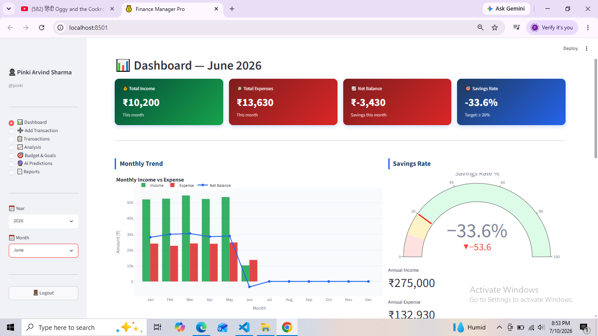
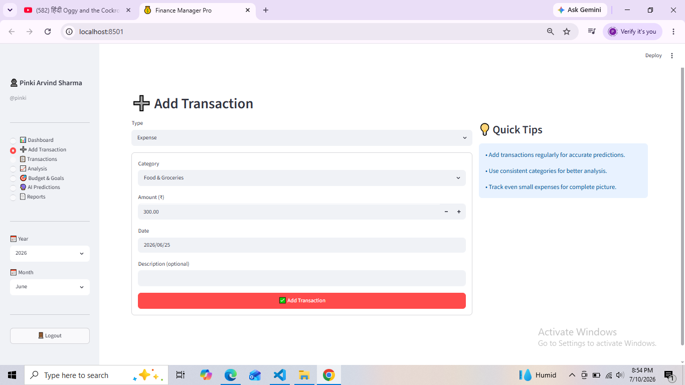
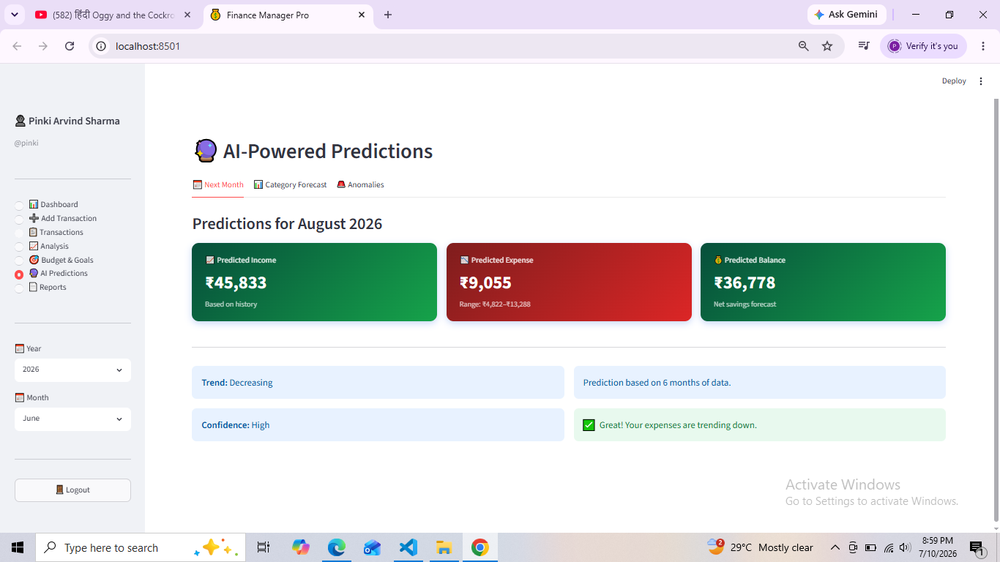
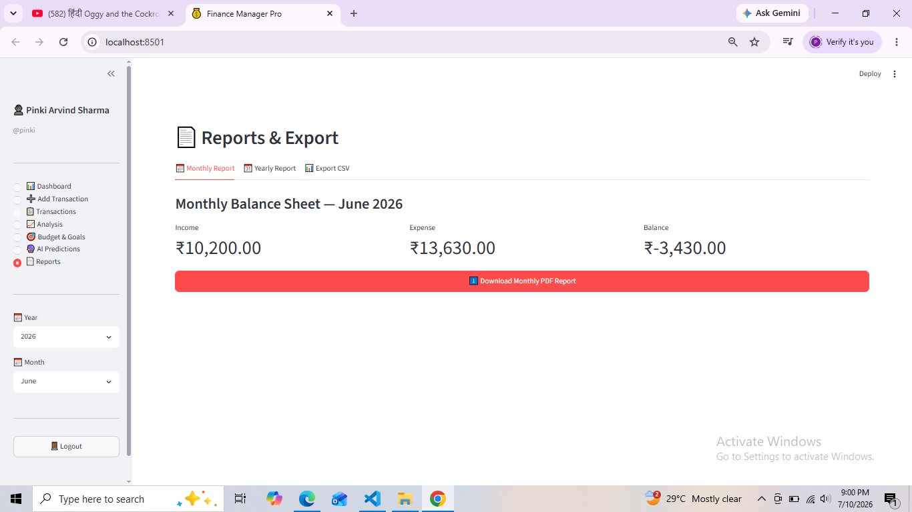

# Personal Financial Assistant

## Overview
A Python-based Personal Financial Assistant that helps users manage income, expenses, budget planning, and financial reports.

## Features
- User Login & Registration
- Add Income & Expenses
- Monthly Balance Sheet
- Expense Prediction (ML)
- PDF Report Generation
- MySQL Database Integration

## Tech Stack
- Python
- Streamlit
- MySQL
- Pandas
- Scikit-Learn
- FPDF

## Installation
pip install -r requirements.txt
streamlit run app.py

## Screenshots
## Login Page

## Dashboard

## Add Transaction

## AI Prediction

## Report

